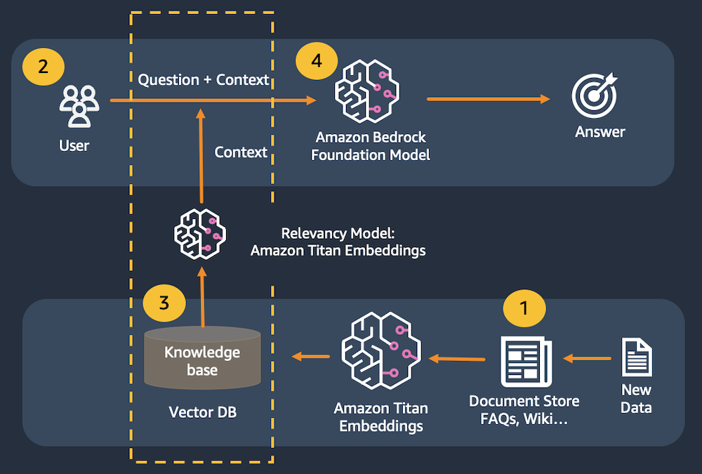

# Overview
This is a simple demo of Amazon Bedrock, with AI21 and Anthropic model with langchain. For more detail please reference the following link:  
- <a href="https://aws.amazon.com/bedrock/" target="_blank">https://aws.amazon.com/bedrock/ </a>
- <a href="https://www.ai21.com/ " target="_blank">https://www.ai21.com/ </a>
- <a href="https://www.anthropic.com/index/claude-2" target="_blank">https://www.anthropic.com/index/claude-2 </a>

# Setup
 Setup <a href='https://docs.aws.amazon.com/cloud9/latest/user-guide/setting-up.html' target='_blank'> Cloud9 <a> 
 Download and install package  
 > git clone https://github.com/nguyendinhthi0705/bedrock-rag-stock.git  
 > cd bedrock-rag-stock  
 > pip3 install -r requirements.txt  

# Architect and Start App
## App 1: Architecture

## Start App 1: qna Chatbot
 >   cd 1_stock_QnA  
 >   streamlit run stock_qna_app.py --server.port 8080
 
#
## App 2: Architecture

## Start App 2: Text To SQL Query 
 >   cd 2_stock_query  
 >   streamlit run stock_query_app.py --server.port 8080
 
#
## App 3: Architecture

## Start App 3: Agent tools
 >   cd 3_stock_analysis  
 >   streamlit run 3_stock_analysis.py --server.port 8080
    